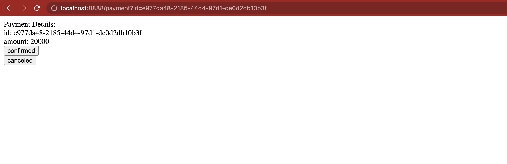

# Mock Bank Gateway

You could use this as a mock server for bank gateways for your development.

# How it works?

## 1. Authorize

You will send an amount and get an ID for your transaction.

### Request
```
- http://localhost:8888/authorize
- Method: POST
- Body
{
    "amount": 20000,
    "callback_url": "http://localhost:8000"
}
```

### Response
```
{
    "id": "e977da48-2185-44d4-97d1-de0d2db10b3f",
    "amount": 20000,
    "callback_url": "http://localhost:8000",
    "status": "ok"
}
```

## 2. Redirect to gateway
You need to add the given ID to a query param and redirect user to do the payment.

### Request
```
- http://localhost:8888/payment?id=e977da48-2185-44d4-97d1-de0d2db10b3f
```

### Response


User could choose to do the payment or cancel the transaction.
Then it will redirect back to the `callback_url` you gave in authorize step.
The transaction id and status will be added to query params.

```
http://localhost:8000/?status=confirmed&id=e977da48-2185-44d4-97d1-de0d2db10b3f
```

## 3. Verify
After user redirected back to your system, you need to verify the transaction.
It will verify only the confirmed transactions.

### Request
```
- http://localhost:8888/verify
- Method: POST
- Body
{
    "id": "e977da48-2185-44d4-97d1-de0d2db10b3f"
}
```

### Response
```
{
    "id": "e977da48-2185-44d4-97d1-de0d2db10b3f",
    "callback_url": "http://localhost:8000",
    "status": "confirmed",
    "amount": 20000,
    "verified_at": "2023-06-03T16:00:22+03:30"
}
```

# Setup

## Docker
You could use the docker image and run a container like this.

```
docker run -d -p 8888:8888 azolf/mock-bank-gateway
```

## docker-compose
```
version: '3'
services:
  app:
    image: azolf/mock-bank-gateway
    container_name: mock_bank_gateway
    ports:
      - 8888:8888
```

## Manual
You could clone this repository, and install the gems and run the webserver with ruby.

```
$ git clone https://github.com/azolf/mock-bank-gateway.git
$ cd mock-bank-gateway/
$ bundle install
$ ruby server.rb
```